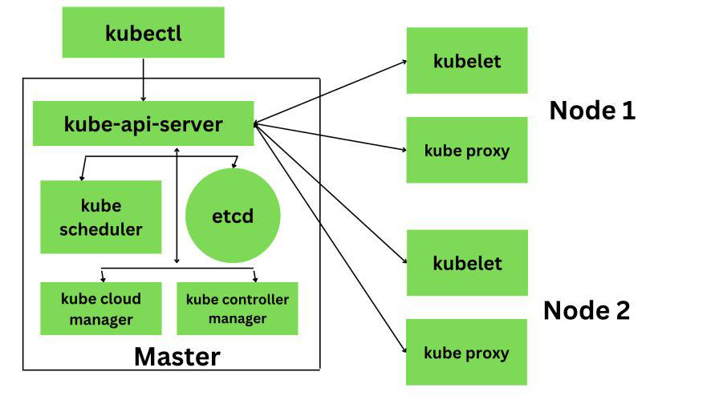
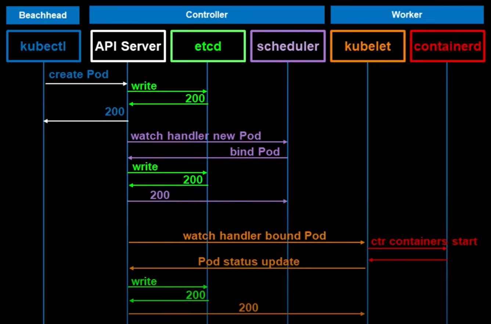

# kubernetes

## What is it?

K8s is an open-source container orchestration platform that automates the deployment, scaling, networking, and management of containerized applications across a cluster of machines.

## What about Docker Compose?

Docker Compose is a tool for managing Docker applications that run in more than one container. A YAML file lists all the networks, volumes, and services that a program needs.

Developers can run multiple containers that are set up to work together with just one command. This makes it easier to run complex applications in development or testing settings.

**Docker Compose** is mainly for local or small-scale setups, while Kubernetes is built for production-grade, distributed systems:

- Multi-host support → manages containers across many machines, not just one.
- Self-healing → restarts failed containers, reschedules Pods on healthy nodes.
- Scaling → automatic horizontal scaling of apps (up/down).
- Load balancing & service discovery → built-in networking to expose apps reliably.
- Declarative configuration → desired state stored in the cluster, continuously reconciled.
- Rolling updates & rollbacks → zero-downtime deployments with version control.
- Resource management → quotas, scheduling based on CPU/RAM availability.

## Kubernetes Components





### Node

A Node is a worker machine in Kubernetes. (like in AWS EC2, GCP Compute Engine, OCI) or a physical server.

- Each Node runs the software necessary to host Pods:
- kubelet → talks to the API server, ensures containers are running.
- container runtime → e.g., Docker, containerd (runs the actual containers).
- kube-proxy → handles networking/routing for Pods on the node.

> An special node called **Master node** is used for the control plane, and the nodes containing the actual application are called **worker nodes**

> Worker nodes used to be called "minions", some people still used that term.

### Pod

A Pod is the smallest deployable unit in Kubernetes.
It represents one or more tightly coupled containers that should always run together on the same Node.

Containers in a Pod:

- Share the same network namespace (same IP address, can talk to each other via localhost).
- Can share storage volumes.
- Are scheduled together.

### Cluster

A Kubernetes Cluster is the whole set of machines (nodes) managed by Kubernetes.

### kubectl

A command line tool used to interact the kubernetes API

### kube-api-server

It is the central control plane component in K8s.

Think of the API server as the “reception desk” of Kubernetes:

- You (user or component) submit a request (like “please create a Pod”).
- The receptionist checks your identity, makes sure the request is valid, and then records it in the system (etcd).
- Other departments (scheduler, controllers, kubelet) pick up the request and act on it.

> The kube-apiserver (and the other control plane components like the scheduler and controller manager) run as containers inside Pods on the control plane (master) node(s).

### etcd

etcd is a distributed key–value store inside the master node

Kubernetes uses it as the backing database to store the entire **cluster state**.

### Scheduler

It is responsible for assigning newly created Pods to appropriate Nodes within a cluster.

Its primary function is to determine which Node a Pod should run on, ensuring efficient resource utilization and adherence to specified constraints.

### kubelet

kubelet is the agent (a process, a daemon) that runs on every node in a Kubernetes cluster.

On Linux systems, you can usually see it with:

```pre
systemctl status kubelet
ps aux | grep kubelet
```

**It’s installed as a system service (often via systemd) or as a binary, not as a container in a Pod.**

Talks to the kube-api-server to get instructions about which Pods should be running on that node.

1. The scheduler assigns a Pod to a worker node.
2. The API server tells kubelet on that node: “Run this Pod with these containers.”
3. The kubelet:
    - Sets up networking (via CNI plugins).
    - Talks to the container runtime (containerd/Docker) to start the containers.
    - Mounts volumes if needed.
4. The kubelet reports back to the control plane:
    - Pod is Running, Pending, or Failed.
    - Sends resource usage and health info.

## Namespaces

A Namespace is a logical partition inside a cluster.
It lets you organize and isolate resources (Pods, Services, Deployments, etc.) within the same cluster.

Common use cases:

- Separate environments (e.g., dev, test, prod).
- Separate teams or projects in a shared cluster.
- Apply different resource limits and access controls.

## Manifests, Objects, Deployments, ReplicaSets, Services

### Manifest

A YAML or JSON file that describes what you want Kubernetes to create or manage.

Think of it as the “blueprint” or “instructions” for Kubernetes.

Example: a manifest can define a Deployment, a Service, or a Pod.

### Object

An entity in Kubernetes that represents the state of your cluster.

Objects are what you create with manifests.

Examples of Kubernetes objects: Pod, Service, Deployment, ReplicaSet, ConfigMap, Secret, Namespace.

Each object has:

- spec: what you want (desired state)
- status: what’s actually running (current state)

### Deployment

A higher-level object used to manage Pods in a scalable and reliable way.

It ensures that the desired number of Pods are always running.

Provides rolling updates and rollbacks.

You almost always use Deployments instead of managing Pods directly.

### ReplicaSet

A controller that makes sure the correct number of identical Pods are running.

It automatically replaces Pods if they crash.

Deployments use ReplicaSets under the hood to maintain Pods.

Usually, you don’t create ReplicaSets directly; you create a Deployment, which creates a ReplicaSet, which creates Pods.

### Service

A way to expose Pods (which can change dynamically) using a stable name and IP address.

Services allow other components or external clients to reach your application reliably.

Types of Services:

ClusterIP (default): internal-only access.

NodePort: exposes the app on each node’s IP with a static port.

LoadBalancer: integrates with cloud load balancers for external access.

## CRI - Container Runtime Interface

In the beginning Kubernetes only supported docker but then CRI was created to work with any runtime as long as the runtime adheres to the Open Container Initiative (OCI).

OCI consists of:

- **imagespec**: specifications of how and image should be build.
- **runtimespec**: how any container runtime should be developed.

HOWEVER, docker was not built along with the CRI. SO for some time kubernetes maintained something called **dockershim** to keep working with Docker because it was the predominant tool for containers.

Then dockershim was deprecated because kubernetes started to support **containerd**.

Think of Docker as having multiple layers:

```pre
Docker CLI/API
     │
 Docker Engine (dockerd)
     │
  containerd
     │
    runc
```

- Docker CLI & Docker API → the developer-friendly interface (e.g., docker run ...).
- Docker Engine (dockerd) → the background daemon that interprets CLI/API calls.
- containerd → the actual container runtime inside Docker.
- runc → the low-level tool that actually spawns containers based on OCI specs.

This means Docker itself already used containerd internally to run containers. Kubernetes originally talked to Docker through dockershim, a compatibility layer, instead of directly to containerd.

Summary:

- Kubernetes created the Container Runtime Interface (CRI) so it could support multiple runtimes (not just Docker).

- Docker never natively implemented CRI → so Kubernetes wrote dockershim, a "middleman" so Kubernetes could talk to Docker.

- But this extra layer was unnecessary because Kubernetes could already work with containerd (or other CRI-compliant runtimes like CRI-O).

- Maintaining dockershim became overhead, so it was deprecated in Kubernetes v1.20 and removed in v1.24.

Before:

```
kubelet → dockershim → dockerd → containerd → runc
```

Now:

```
kubelet → containerd → runc
```

### ctr

ctr is a command line tool that comes with containerD.

- Not very used friendly
- Only supports limited features

This is why a tool called `nerdctl` is used, it provides a docker-like CLI for containerD.

## crictl

crictl provides a CLI for CRI compatible container runtimes.

It is mostly used for debugging not to create containers (although is possible).

## Quick YAML Guide

YAML (YAML Ain’t Markup Language) is a human-friendly format for configuration files.  
It uses **indentation (spaces, not tabs)** to define structure.

- **comments**:
    ```yaml
    # this is a comment
    ```
- **Key-value pairs**:
    ```yaml
    name: Noah
    age: 28
    ```
- **strings**:
    ```yaml
    greeting: "Hello World"
    path: 'C:\Users\Noah'
    ```
- **numbers and booleans**:
    ```yaml
    count: 10
    pi: 3.14
    active: true
    ```
- **simple list**:
    ```yaml
    fruits:
        - apple
        - banana
        - orange
    ```
- **list of objects**:
    ```yaml
    users:
    - name: Alice
        role: admin
    - name: Bob
        role: user
    ```
- **maps**:
    ```yaml
    database:
        host: localhost
        port: 5432
        username: admin
        password: secret
    ```
- **null values**:
    ```yaml
    middle_name: null
    ```
- **multi-line strings**:
    ```yaml
    description: |
        This is a long text
        that spans multiple lines.
    ```